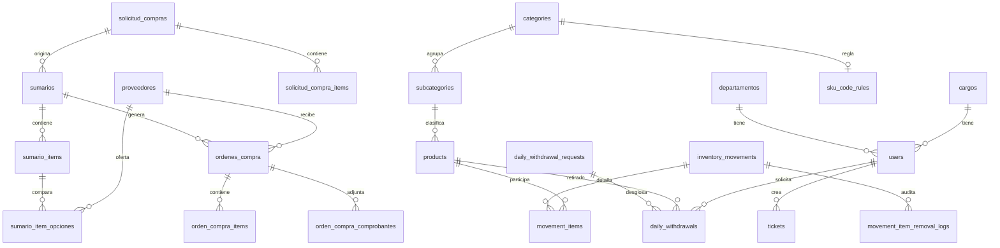

# Documentacion de Base de Datos (derivada de migraciones)

Fecha de elaboracion: 2026-04-30
Origen: analisis de `database/migrations/*.php`

## 1. Alcance y criterio

Este documento se construyo leyendo las migraciones del proyecto. Incluye:
- Tablas creadas.
- Campos (columnas), tipos y nulabilidad cuando aplica.
- Claves primarias (PK), foraneas (FK), unicas e indices.
- Clasificacion por tipo de tabla: maestras, proceso, seguridad e infraestructura.
- Relaciones para construir un DER.
- Vistas y migraciones de alteracion de esquema/datos.

Notas:
- En Laravel, `id()` equivale a `BIGINT UNSIGNED AUTO_INCREMENT` (o equivalente por motor).
- `timestamps()` crea `created_at` y `updated_at`.
- Algunas tablas de permisos dependen de `config/permission.php` (nombres y columnas dinamicas).

## 2. Clasificacion funcional

### 2.1 Tablas maestras (catalogo)
- `departamentos`
- `cargos`
- `impresoras`
- `categories`
- `subcategories`
- `products`
- `sku_code_rules`
- `proveedores`
- `bcv_rates`

### 2.2 Tablas de proceso (transaccionales)
- `tickets`
- `solicitud_compras`
- `solicitud_compra_items`
- `inventory_movements`
- `movement_items`
- `movement_item_removal_logs`
- `daily_withdrawal_requests`
- `daily_withdrawals`
- `sumarios`
- `sumario_items`
- `sumario_item_opciones`
- `ordenes_compra`
- `orden_compra_items`
- `orden_compra_comprobantes`

### 2.3 Seguridad/autenticacion/autorizacion
- `users`
- `password_reset_tokens`
- `sessions`
- `permissions`
- `roles`
- `model_has_permissions`
- `model_has_roles`
- `role_has_permissions`

### 2.4 Infraestructura/framework
- `cache`
- `cache_locks`
- `jobs`
- `job_batches`
- `failed_jobs`
- `notifications`
- `form_drafts`

## 3. Diccionario de tablas

## 3.1 Infraestructura/framework

### Tabla: `cache`
- PK: `key` (string)
- Campos:
  - `key` string, PK
  - `value` mediumText
  - `expiration` integer, index
- FK: no aplica

### Tabla: `cache_locks`
- PK: `key` (string)
- Campos:
  - `key` string, PK
  - `owner` string
  - `expiration` integer, index
- FK: no aplica

### Tabla: `jobs`
- PK: `id`
- Campos:
  - `id` id
  - `queue` string, index
  - `payload` longText
  - `attempts` unsignedTinyInteger
  - `reserved_at` unsignedInteger, nullable
  - `available_at` unsignedInteger
  - `created_at` unsignedInteger
- FK: no aplica

### Tabla: `job_batches`
- PK: `id` (string)
- Campos:
  - `id` string, PK
  - `name` string
  - `total_jobs` integer
  - `pending_jobs` integer
  - `failed_jobs` integer
  - `failed_job_ids` longText
  - `options` mediumText, nullable
  - `cancelled_at` integer, nullable
  - `created_at` integer
  - `finished_at` integer, nullable
- FK: no aplica

### Tabla: `failed_jobs`
- PK: `id`
- Campos:
  - `id` id
  - `uuid` string, unique
  - `connection` text
  - `queue` text
  - `payload` longText
  - `exception` longText
  - `failed_at` timestamp, default current
- FK: no aplica

### Tabla: `notifications`
- PK: `id` (uuid)
- Campos:
  - `id` uuid, PK
  - `type` string
  - `notifiable_type` string, index (por `morphs`)
  - `notifiable_id` unsignedBigInteger, index (por `morphs`)
  - `data` json/jsonb segun motor
  - `read_at` timestamp, nullable
  - `created_at`, `updated_at` timestamps
- FK: no aplica (relacion polimorfica)

### Tabla: `form_drafts`
- PK: `id`
- Campos:
  - `id` id
  - `user_id` foreignId
  - `form_key` string(190)
  - `payload` json, nullable
  - `expires_at` timestamp, nullable, index
  - `created_at`, `updated_at` timestamps
- FK:
  - `user_id` -> `users.id` (cascadeOnDelete)
- Restricciones:
  - unique (`user_id`, `form_key`)

## 3.2 Seguridad / acceso

### Tabla: `departamentos`
- PK: `id`
- Campos:
  - `id` id
  - `nombre` string, unique

### Tabla: `cargos`
- PK: `id`
- Campos:
  - `id` id
  - `nombre` string, unique
- Observacion:
  - La migracion inserta datos semilla: Analista, Lider, Tecnico, Coordinador, Vicepresidente, Gerente.

### Tabla: `users`
- PK: `id`
- Campos:
  - `id` id
  - `name` string
  - `departamento_id` foreignId, nullable
  - `cargo_id` foreignId, nullable
  - `email` string, unique
  - `email_verified_at` timestamp, nullable
  - `password` string
  - `firma_password` string, nullable
  - `withdrawal_password` string, nullable
  - `remember_token`
  - `created_at`, `updated_at` timestamps
- FK:
  - `departamento_id` -> `departamentos.id` (nullOnDelete)
  - `cargo_id` -> `cargos.id` (nullOnDelete)

### Tabla: `password_reset_tokens`
- PK: `email` (string)
- Campos:
  - `email` string, PK
  - `token` string
  - `created_at` timestamp, nullable

### Tabla: `sessions`
- PK: `id` (string)
- Campos:
  - `id` string, PK
  - `user_id` foreignId, nullable, index
  - `ip_address` string(45), nullable
  - `user_agent` text, nullable
  - `payload` longText
  - `last_activity` integer, index
- FK:
  - No definida explicitamente en migracion (solo index)

### Tabla: `permissions` (spatie, nombre configurable)
- PK: `id` bigIncrements
- Campos:
  - `id`
  - `name` string
  - `guard_name` string
  - `created_at`, `updated_at`
- Restricciones:
  - unique (`name`, `guard_name`)

### Tabla: `roles` (spatie, nombre configurable)
- PK: `id` bigIncrements
- Campos base:
  - `id`
  - `name` string
  - `guard_name` string
  - `created_at`, `updated_at`
- Campos opcionales:
  - `team_foreign_key` nullable si teams habilitado
- Restricciones:
  - unique (`name`, `guard_name`) o (`team_foreign_key`, `name`, `guard_name`) si teams

### Tabla: `model_has_permissions` (pivot polimorfica)
- PK compuesta:
  - sin teams: (`permission_id`, `model_morph_key`, `model_type`)
  - con teams: (`team_foreign_key`, `permission_id`, `model_morph_key`, `model_type`)
- Campos:
  - `permission_id`
  - `model_type`
  - `model_morph_key`
  - `team_foreign_key` (opcional)
- FK:
  - `permission_id` -> `permissions.id` (cascade delete)

### Tabla: `model_has_roles` (pivot polimorfica)
- PK compuesta:
  - sin teams: (`role_id`, `model_morph_key`, `model_type`)
  - con teams: (`team_foreign_key`, `role_id`, `model_morph_key`, `model_type`)
- Campos:
  - `role_id`
  - `model_type`
  - `model_morph_key`
  - `team_foreign_key` (opcional)
- FK:
  - `role_id` -> `roles.id` (cascade delete)

### Tabla: `role_has_permissions` (pivot)
- PK compuesta: (`permission_id`, `role_id`)
- Campos:
  - `permission_id`
  - `role_id`
- FK:
  - `permission_id` -> `permissions.id` (cascade delete)
  - `role_id` -> `roles.id` (cascade delete)

## 3.3 Catalogo maestro

### Tabla: `impresoras`
- PK: `id`
- Campos:
  - `id` id
  - `codigo` string, unique
  - `nombre` string
  - `created_at`, `updated_at`

### Tabla: `categories`
- PK: `id`
- Campos:
  - `id` id
  - `name` string, unique
  - `created_at`, `updated_at`

### Tabla: `subcategories`
- PK: `id`
- Campos:
  - `id` id
  - `name` string
  - `category_id` foreignId
  - `created_at`, `updated_at`
- FK:
  - `category_id` -> `categories.id` (cascadeOnDelete)
- Restricciones:
  - unique (`name`, `category_id`)

### Tabla: `products`
- PK: `id`
- Campos:
  - `id` id
  - `sku` string, unique
  - `cod_ingreso` string
  - `descripcion` text
  - `marca` string
  - `subcategory_id` foreignId
  - `serial` string
  - `estado` string
  - `medida` string
  - `ubicacion` string
  - `dpto_responsable` string
  - `stock_minimo` unsignedInteger
  - `stock_actual` unsignedInteger, default 0
  - `precio_unitario` decimal(14,2)
  - `fecha_adquisicion` date
  - `fecha_ultima_entrada` date, nullable
  - `fecha_ultima_salida` date, nullable
  - `is_archived` boolean, default false
  - `created_at`, `updated_at`
- FK:
  - `subcategory_id` -> `subcategories.id` (cascadeOnDelete)

### Tabla: `sku_code_rules`
- PK: `id`
- Campos:
  - `id` id
  - `category_id` foreignId
  - `prefix` string(10), unique
  - `next_correlative` unsignedInteger, default 1
  - `number_length` unsignedTinyInteger, default 4
  - `is_active` boolean, default true
  - `notes` text, nullable
  - `created_at`, `updated_at`
- FK:
  - `category_id` -> `categories.id` (cascadeOnDelete)
- Restricciones:
  - unique (`category_id`)

### Tabla: `proveedores`
- PK: `id`
- Campos:
  - `id` id
  - `nombre` string
  - `rif` string, unique
  - `direccion` string
  - `ciudad` string
  - `email` string, nullable
  - `contacto` string
  - `telefono` string(50)
  - `created_at`, `updated_at`

### Tabla: `bcv_rates`
- PK: `id`
- Campos:
  - `id` id
  - `rate_date` date, unique
  - `rate` decimal(12,6)
  - `source` string(100)
  - `source_url` string, nullable
  - `fetched_at` timestamp, nullable
  - `payload` json, nullable
  - `created_at`, `updated_at`

## 3.4 Proceso / transaccional

### Tabla: `tickets`
- PK: `id`
- Campos:
  - `id` id
  - `user_id` foreignId
  - `nombre_solicitante` string
  - `departamento` string
  - `tipo_solicitud` enum('SOPORTE_IT','CAMBIO_TONER')
  - `nivel_urgencia` string, nullable
  - `equipo_afectado` string, nullable
  - `descripcion_problema` text, nullable
  - `codigo_impresora` string, nullable
  - `color_toner` string, nullable
  - `estado` enum('Abierto','En Proceso','Resuelto','Cancelado'), default 'Abierto'
  - `created_at`, `updated_at`
- FK:
  - `user_id` -> `users.id` (cascadeOnDelete)
- Indices:
  - index compuesto (`estado`, `created_at`)

### Tabla: `solicitud_compras`
- PK: `id`
- Campos principales:
  - Identificacion: `codigo_control`, `numero_solicitud_usuario` (index), `codigo_control_procura`, `fecha_solicitud`
  - Clasificacion: `tipo_solicitud`, `prioridad`
  - Contexto: `departamento_solicitante`, `para_ser_usado_en`, `centro`, `elemento`, `cuenta`, `contrato`
  - Firmas/cargos: `cargo_solicitante`, `cargo_almacen`, `cargo_aprobador`, `cargo_receptor`, `firma_solicitante`, `firma_almacen`, `firma_aprobador`, `firma_receptor`
  - Fechas: `fecha_solicitante`, `fecha_almacen`, `fecha_aprobador`, `fecha_receptor`, `hora_receptor`
  - Rechazo: `rechazo_etapa`, `rechazo_comentario`, `rechazo_en`
  - Control: `recepcion_conforme` boolean default false, `estado` string default 'BORRADOR'
  - Auditoria: `created_at`, `updated_at`
- FK:
  - `solicitado_por_user_id` -> `users.id` (cascadeOnDelete)
  - `por_almacen_user_id` -> `users.id` (nullOnDelete)
  - `aprobado_por_user_id` -> `users.id` (nullOnDelete)
  - `recibido_por_user_id` -> `users.id` (nullOnDelete)
  - `rechazo_por_user_id` -> `users.id` (nullOnDelete)
  - `rechazo_destinatario_user_id` -> `users.id` (nullOnDelete)
- Indices:
  - `numero_solicitud_usuario` (`solicitud_compras_numero_usuario_idx`)

### Tabla: `solicitud_compra_items`
- PK: `id`
- Campos:
  - `id` id
  - `solicitud_compra_id` foreignId
  - `item` unsignedInteger, nullable
  - `descripcion` string, nullable
  - `unidad_medida` string(20), nullable, default 'UND'
  - `cantidad_solicitada` decimal(12,2), nullable
  - `cantidad_existencia` decimal(12,2), nullable
  - `cantidad_a_comprar` decimal(12,2), nullable
  - `estado_item` string(40), default 'SIN_PROCESAR'
  - `cantidad_pedida` decimal(12,2), default 0
  - `cantidad_en_sumario` decimal(12,2), default 0
  - `cantidad_comprada` decimal(12,2), default 0
  - `created_at`, `updated_at`
- FK:
  - `solicitud_compra_id` -> `solicitud_compras.id` (cascadeOnDelete)

### Tabla: `inventory_movements`
- PK: `id`
- Campos:
  - `id` id
  - `tipo` enum('ingreso','entrada','salida')
  - `nro_control` string, nullable
  - `fecha` date
  - `orden_compra` string, nullable
  - `nro_solicitud` string, nullable
  - `factura_nota` string, nullable
  - `nro_doc_legal` string, nullable
  - `proveedor` string, nullable
  - `almacenista` string, nullable
  - `solicitar_formato_entrada` boolean, default false
  - `responsable_destino` string, nullable
  - `dpto_destino` string, nullable
  - `comentarios` text, nullable
  - `total_items` unsignedInteger, default 0
  - `created_by_user_id` foreignId, nullable
  - `updated_by_user_id` foreignId, nullable
  - `created_at`, `updated_at`
- FK:
  - `created_by_user_id` -> `users.id` (nullOnDelete)
  - `updated_by_user_id` -> `users.id` (nullOnDelete)
- Indices:
  - `tipo`, `fecha`, `nro_control`, (`tipo`,`solicitar_formato_entrada`), `created_by_user_id`, `updated_by_user_id`

### Tabla: `movement_items`
- PK: `id`
- Campos:
  - `id` id
  - `movement_id` foreignId
  - `product_id` foreignId
  - `cantidad` unsignedInteger
  - `precio_momento` decimal(14,2), nullable
  - `retorna` boolean, default false
  - `observaciones_item` text, nullable
  - `created_at`, `updated_at`
- FK:
  - `movement_id` -> `inventory_movements.id` (cascadeOnDelete)
  - `product_id` -> `products.id` (restrictOnDelete)
- Indices:
  - `movement_id`, `product_id`

### Tabla: `movement_item_removal_logs`
- PK: `id`
- Campos:
  - `id` id
  - `movement_id` foreignId
  - `movement_item_id` foreignId, nullable
  - `product_id` foreignId, nullable
  - `sku_snapshot` string(80), nullable
  - `cantidad` unsignedInteger, default 0
  - `motivo` string(50)
  - `removed_by_user_id` foreignId, nullable
  - `created_at`, `updated_at`
- FK:
  - `movement_id` -> `inventory_movements.id` (cascadeOnDelete)
  - `movement_item_id` -> `movement_items.id` (nullOnDelete)
  - `product_id` -> `products.id` (nullOnDelete)
  - `removed_by_user_id` -> `users.id` (nullOnDelete)
- Indices:
  - (`movement_id`, `created_at`), `motivo`

### Tabla: `daily_withdrawal_requests`
- PK: `id`
- Campos:
  - `id` id
  - `user_id` foreignId
  - `destination` string
  - `requires_return` boolean, default false
  - `return_date` timestamp, nullable
  - `status` enum('pendiente','aprobado','rechazado'), default 'pendiente'
  - `requested_at` timestamp, default current
  - `created_at`, `updated_at`
- FK:
  - `user_id` -> `users.id` (cascadeOnDelete)
- Indices:
  - `status`, `requested_at`, `user_id`

### Tabla: `daily_withdrawals`
- PK: `id`
- Campos:
  - `id` id
  - `daily_withdrawal_request_id` foreignId, nullable
  - `user_id` foreignId
  - `product_id` foreignId
  - `quantity` decimal(14,2)
  - `destination` string
  - `requires_return` boolean, default false
  - `return_date` timestamp, nullable
  - `status` enum('pendiente','aprobado','rechazado'), default 'pendiente'
  - `rejection_reason` string(255), nullable
  - `warehouse_user_id` foreignId, nullable
  - `requested_at` timestamp, default current
  - `created_at`, `updated_at`
- FK:
  - `daily_withdrawal_request_id` -> `daily_withdrawal_requests.id` (nullOnDelete)
  - `user_id` -> `users.id` (cascadeOnDelete)
  - `product_id` -> `products.id` (restrictOnDelete)
  - `warehouse_user_id` -> `users.id` (nullOnDelete)
- Indices:
  - `daily_withdrawal_request_id`, `status`, `requested_at`, `user_id`, `product_id`, `warehouse_user_id`

### Tabla: `sumarios`
- PK: `id`
- Campos:
  - `id` id
  - `solicitud_compra_id` foreignId
  - `correlativo_sdc` string, unique
  - `fecha` date
  - `procedencia` enum('LOCAL','IMPORTADO')
  - `tipo_orden` enum('COMPRA','SERVICIO')
  - `departamento_solicitante` string
  - `total_compra_prov1` decimal(14,2) default 0
  - `total_compra_prov2` decimal(14,2) default 0
  - `total_compra_prov3` decimal(14,2) default 0
  - `condiciones_pago` string, nullable
  - `tiempo_entrega` string, nullable
  - `prioridad` enum('MEJOR_PRECIO','CALIDAD'), nullable
  - `proveedor_ganador_id` foreignId, nullable
  - `observaciones` text, nullable
  - `elaborado_por_user_id` foreignId, nullable
  - `revisado_por_user_id` foreignId, nullable
  - `estado` string(50), default 'BORRADOR'
  - `workflow_estado` string(50), default 'BORRADOR'
  - `enviado_validacion_finanzas_at` timestamp, nullable
  - `enviado_por_user_id` foreignId, nullable
  - `validado_finanzas_at` timestamp, nullable
  - `validado_por_user_id` foreignId, nullable
  - `validacion_finanzas_resultado` string(30), nullable
  - `validacion_finanzas_comentario` text, nullable
  - `decision_gerencia_finanzas_at` timestamp, nullable
  - `decision_gerencia_por_user_id` foreignId, nullable
  - `decision_gerencia_resultado` string(30), nullable
  - `decision_gerencia_comentario` text, nullable
  - `created_at`, `updated_at`
- FK:
  - `solicitud_compra_id` -> `solicitud_compras.id` (cascadeOnDelete)
  - `proveedor_ganador_id` -> `proveedores.id` (nullOnDelete)
  - `elaborado_por_user_id` -> `users.id` (nullOnDelete)
  - `revisado_por_user_id` -> `users.id` (nullOnDelete)
  - `enviado_por_user_id` -> `users.id` (nullOnDelete)
  - `validado_por_user_id` -> `users.id` (nullOnDelete)
  - `decision_gerencia_por_user_id` -> `users.id` (nullOnDelete)

### Tabla: `sumario_items`
- PK: `id`
- Campos:
  - `id` id
  - `sumario_id` foreignId
  - `solicitud_compra_item_id` foreignId
  - `item` unsignedInteger, nullable
  - `descripcion` string
  - `unidad_medida` string(20), default 'UND'
  - `cantidad` decimal(12,2)
  - `validacion_gerencia_resultado` string(20), nullable
  - `validacion_gerencia_comentario` text, nullable
  - `sub_estado` string(60), default 'PENDIENTE_OC'
  - `created_at`, `updated_at`
- FK:
  - `sumario_id` -> `sumarios.id` (cascadeOnDelete)
  - `solicitud_compra_item_id` -> `solicitud_compra_items.id` (cascadeOnDelete)
- Restricciones:
  - unique (`sumario_id`, `solicitud_compra_item_id`) (`sumario_item_unique`)

### Tabla: `sumario_item_opciones`
- PK: `id`
- Campos:
  - `id` id
  - `sumario_item_id` foreignId
  - `opcion_numero` unsignedTinyInteger
  - `proveedor_id` foreignId, nullable
  - `proveedor_nombre` string
  - `marca` string, nullable
  - `precio_unitario` decimal(14,2), default 0
  - `precio_total` decimal(14,2), default 0
  - `seleccionada` boolean, default false
  - `created_at`, `updated_at`
- FK:
  - `sumario_item_id` -> `sumario_items.id` (cascadeOnDelete)
  - `proveedor_id` -> `proveedores.id` (nullOnDelete)
- Restricciones:
  - unique (`sumario_item_id`, `opcion_numero`) (`sumario_opcion_unique`)

### Tabla: `ordenes_compra`
- PK: `id`
- Campos (resumen estructurado):
  - Identificacion y proveedor: `correlativo_odc` unique, `sumario_id`, `proveedor_id`, `rif_proveedor`, `direccion_proveedor`, `email_proveedor`, `contacto_proveedor`
  - Contexto comercial: `tasa_bcv` decimal(14,6), `condicion_pago`, `departamento_solicitante`, `sitio_entrega`, `comentarios`
  - Firma/aprobacion: `elaborado_por_user_id`, `elaborado_firmado_at`, `aprobado_por_user_id`, `aprobado_firmado_at`
  - Montos: `monto_exento`, `sub_total`, `iva_16`, `gastos_adicionales`, `total_general` (decimal 14,2)
  - Workflow: `estado` default 'PENDIENTE_APROBACION', `workflow_post_compra` default 'PENDIENTE_PAGO_FINANZAS'
  - Pago: `pago_registrado_at`, `pago_por_user_id`, `comprobante_pago_path`, `referencia_pago`, `monto_pagado`, `observacion_pago`
  - Post-pago y recepcion: `confirmado_procura_at`, `confirmado_por_user_id`, `tipo_documento_recepcion`
  - Facturacion/administracion: `factura_path`, `factura_numero`, `factura_numero_control`, `factura_fecha_emision`, `factura_base_imponible`, `factura_monto_iva`, `factura_monto_total`, `retencion_iva_monto`, `retencion_islr_monto`, `comprobantes_retencion_paths` (json), `observacion_administracion`, `factura_cargada_administracion_at`, `factura_cargada_por_user_id`, `factura_enviada_administracion_at`, `factura_enviada_por_user_id`, `factura_pendiente`
  - Conformidad/devolucion: `recepcion_procesada_at`, `recibido_por_user_id`, `conformidad_solicitante_at`, `conformidad_por_user_id`, `devolucion_solicitada_at`, `devolucion_solicitada_por_user_id`, `devolucion_motivo`
  - Integracion inventario y rechazo: `inventario_movimiento_id`, `factura_procesada_administracion_at`, `rechazo_etapa`, `rechazo_comentario`, `rechazo_por_user_id`, `rechazo_en`
  - Auditoria: `created_at`, `updated_at`
- FK:
  - `sumario_id` -> `sumarios.id` (cascadeOnDelete)
  - `proveedor_id` -> `proveedores.id` (restrictOnDelete)
  - `elaborado_por_user_id` -> `users.id` (nullOnDelete)
  - `aprobado_por_user_id` -> `users.id` (nullOnDelete)
  - `pago_por_user_id` -> `users.id` (nullOnDelete)
  - `confirmado_por_user_id` -> `users.id` (nullOnDelete)
  - `factura_cargada_por_user_id` -> `users.id` (nullOnDelete)
  - `factura_enviada_por_user_id` -> `users.id` (nullOnDelete)
  - `recibido_por_user_id` -> `users.id` (nullOnDelete)
  - `conformidad_por_user_id` -> `users.id` (nullOnDelete)
  - `devolucion_solicitada_por_user_id` -> `users.id` (nullOnDelete)
  - `inventario_movimiento_id` -> `inventory_movements.id` (nullOnDelete)
  - `rechazo_por_user_id` -> `users.id` (nullOnDelete)

### Tabla: `orden_compra_items`
- PK: `id`
- Campos:
  - `id` id
  - `orden_compra_id` foreignId
  - `sumario_item_id` foreignId, nullable
  - `solicitud_compra_item_id` foreignId
  - `item` unsignedInteger, nullable
  - `descripcion` string
  - `unidad_medida` string(20), default 'UND'
  - `cantidad` decimal(12,2)
  - `precio_unitario` decimal(14,2), default 0
  - `precio_total` decimal(14,2), default 0
  - `estado_recepcion` string(40), default 'PENDIENTE_RECEPCION'
  - `en_transicion_at` timestamp, nullable
  - `entregado_at` timestamp, nullable
  - `decision_solicitante` string(20), nullable
  - `motivo_rechazo_solicitante` text, nullable
  - `conformidad_solicitante_at` timestamp, nullable
  - `procesado_almacen_at` timestamp, nullable
  - `modo_ingreso_almacen` string(30), nullable
  - `product_id` foreignId, nullable
  - `created_at`, `updated_at`
- FK:
  - `orden_compra_id` -> `ordenes_compra.id` (cascadeOnDelete)
  - `sumario_item_id` -> `sumario_items.id` (nullOnDelete)
  - `solicitud_compra_item_id` -> `solicitud_compra_items.id` (restrictOnDelete)
  - `product_id` -> `products.id` (nullOnDelete)

### Tabla: `orden_compra_comprobantes`
- PK: `id`
- Campos:
  - `id` id
  - `orden_compra_id` foreignId
  - `archivo_path` string
  - `subido_por_user_id` foreignId, nullable
  - `created_at`, `updated_at`
- FK:
  - `orden_compra_id` -> `ordenes_compra.id` (cascadeOnDelete)
  - `subido_por_user_id` -> `users.id` (nullOnDelete)

## 4. Vistas

### Vista: `vw_solicitud_trazabilidad`
- Creacion: migracion `2026_04_23_090100_create_solicitud_trazabilidad_view.php`
- Motor soportado: PostgreSQL y MySQL (queries adaptadas por driver).
- Objetivo:
  - Consolidar trazabilidad por item de solicitud de compra.
  - Relacionar `solicitud_compra_items` con `sumario_items` y `orden_compra_items`.
  - Calcular:
    - `cantidad_faltante = max(cantidad_pedida - cantidad_comprada, 0)`
    - `estado_item_trazabilidad`: `Pedido`, `Faltante`, `Comprado`.
- Claves de salida:
  - `solicitud_compra_id`, `solicitud_compra_item_id`, `solicitud_numero`, `sumario_ids`, `orden_compra_ids`, `cantidad_*`, `estado_item_trazabilidad`.

## 5. Migraciones de alteracion y de datos

### `2026_04_15_111036_drop_solicitud_compras_check_constraints.php`
- Ejecuta `DB::statement(...)` para eliminar checks (PostgreSQL):
  - `solicitud_compras_estado_check`
  - `solicitud_compras_tipo_solicitud_check`
  - `sumarios_estado_check`
- Impacto:
  - Mayor flexibilidad de valores en columnas antes validadas por check/enum nativo.

### `2026_04_23_090200_migrate_solicitud_compra_states_to_new_flow.php`
- Actualiza datos historicos en `solicitud_compras.estado`:
  - `EN_ESPERA_DE_COTIZACION` -> `EN_ESPERA_ALMACEN`
  - `SUMARIO_EN_REVISION` -> `RECIBIDO_POR_PROCURA`
  - `OC_PENDIENTE_APROBACION`, `ORDEN_APROBADA`, `PAGADO`, `EN_CREDITO`, `MATERIAL_RECIBIDO`, `CERRADA` -> `RECIBIDO_POR_PROCURA`
- Impacto:
  - Homologa estados al nuevo flujo operativo.

## 6. Relaciones para DER (cardinalidades)

Relaciones principales 1 a N:
- `departamentos` 1 --- N `users`
- `cargos` 1 --- N `users`
- `users` 1 --- N `tickets`
- `users` 1 --- N `solicitud_compras` (en varios roles)
- `solicitud_compras` 1 --- N `solicitud_compra_items`
- `solicitud_compras` 1 --- N `sumarios`
- `sumarios` 1 --- N `sumario_items`
- `sumario_items` 1 --- N `sumario_item_opciones`
- `sumarios` 1 --- N `ordenes_compra`
- `ordenes_compra` 1 --- N `orden_compra_items`
- `ordenes_compra` 1 --- N `orden_compra_comprobantes`
- `categories` 1 --- N `subcategories`
- `subcategories` 1 --- N `products`
- `categories` 1 --- 0..1 `sku_code_rules` (por unique `category_id`)
- `inventory_movements` 1 --- N `movement_items`
- `products` 1 --- N `movement_items`
- `inventory_movements` 1 --- N `movement_item_removal_logs`
- `products` 1 --- N `movement_item_removal_logs`
- `daily_withdrawal_requests` 1 --- N `daily_withdrawals`
- `users` 1 --- N `daily_withdrawal_requests`
- `users` 1 --- N `daily_withdrawals`
- `products` 1 --- N `daily_withdrawals`
- `proveedores` 1 --- N `sumarios` (proveedor_ganador)
- `proveedores` 1 --- N `ordenes_compra`
- `proveedores` 1 --- N `sumario_item_opciones`
- `inventory_movements` 1 --- N `ordenes_compra` (via `inventario_movimiento_id`, nullable)

Relaciones N a N (via pivotes):
- `users/modelos` N --- N `roles` via `model_has_roles` (polimorfica)
- `users/modelos` N --- N `permissions` via `model_has_permissions` (polimorfica)
- `roles` N --- N `permissions` via `role_has_permissions`

## 7. DER sugerido (Mermaid)

## 8. Observaciones tecnicas para modelado

- No se observan `softDeletes()` en las tablas de negocio; la eliminacion es fisica o por anulacion de estado.
- El dominio compras usa varios estados (`estado`, `workflow_estado`, `workflow_post_compra`, `sub_estado`, `estado_item`) que deben modelarse como maquina de estados de aplicacion.
- `sessions.user_id` no tiene FK explicita en migracion (solo indice).
- En permisos (Spatie), los nombres reales pueden variar por configuracion (`table_names`, `column_names`).
- `notifications` y tablas polimorficas no son relaciones FK tradicionales para DER relacional estricto, pero si relaciones lógicas.
